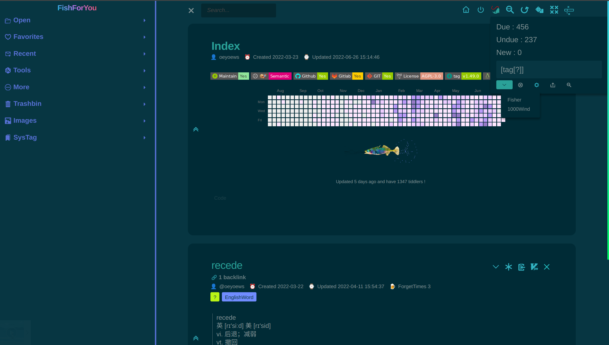

<h1 align="center">FishForYou</h1>

<div align="center">


<hr>


</div>

<hr>

## ShowCases

<div align="center">
  
</div>

## 📢 What's the tw5?

> coming

## ⛴️ Features

> coming

## 🧳 Install

```bash
curl -fsSL oeyoew.fun/install-tw5.sh | bash
```

## 🏡 Running

```bash
yarn install  # install dependencies
yarn start    # start tiddlywiki
```

```bash
tiddlywiki folderName --init server  # init new folder
```

```bash
tiddlywiki --listen port=8080 host=0.0.0.0  # listen 0.0.0.0
```

## 🌳 TODO

[TODO](docs/TODO.md)

## 🔫 CHANGELOG

[CHANGELOG](docs/CHANGELOG.md)
