## pie

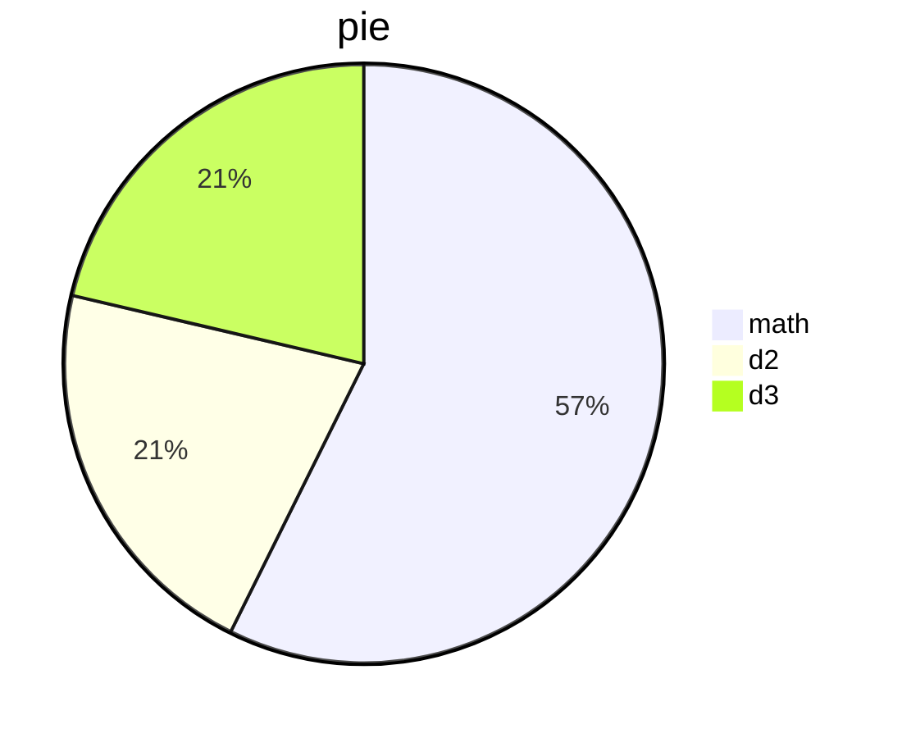
```mermaid
pie 
title pie
"math": 86
"d2": 32
"d3": 32
```

## flowchart

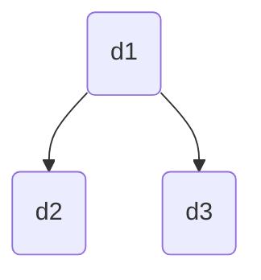
```mermaid
flowchart TD
a(d1) --> b(d2)
a --> c(d3)
```

```mermaid
flowchart TB
a(d1) --> b(d2)
a --> c(d3)
```

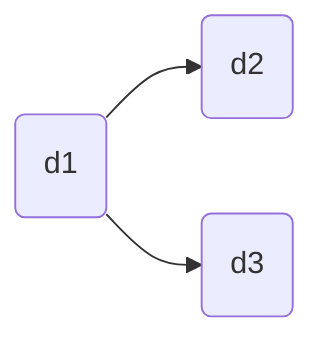
```mermaid
flowchart LR
a(d1) --> b(d2)
a --> c(d3)
```

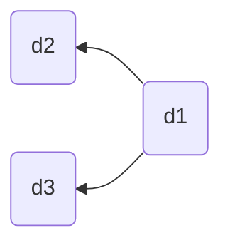
```mermaid
flowchart RL
a(d1) --> b(d2)
a --> c(d3)
```

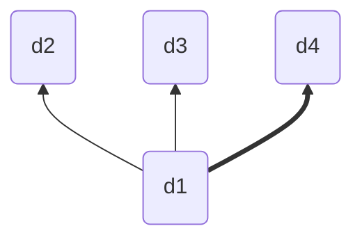
```mermaid
flowchart BT
a(d1) --> b(d2)
a --> c(d3)
a ==> d(d4)

```

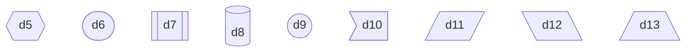
```mermaid
```

```mermaid
flowchart TD 
f{{d5}}
g([d6])
h[[d7]]
i[(d8)]
j((d9))
k>d10]
l[/d11/]
m[\d12\]
n[/d13\]

```

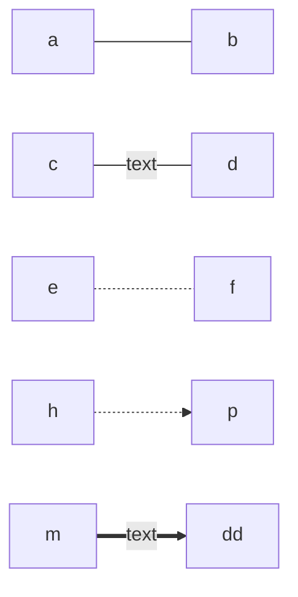
```mermaid
flowchart LR
a --- b
c -- text --- d
e -.- f
h -.-> p

m == text ==> dd
```

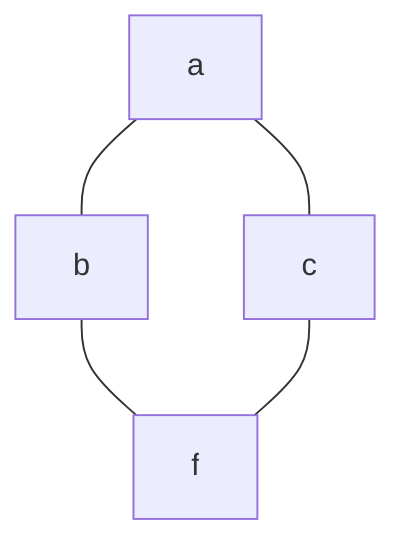
```mermaid
flowchart
a --- b & c --- f
```

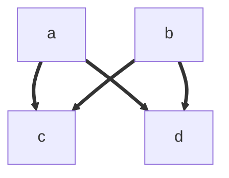
```mermaid
flowchart 
a & b ==> c & d
```

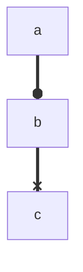
```mermaid
flowchart 
a ==o b
b ==x c
```

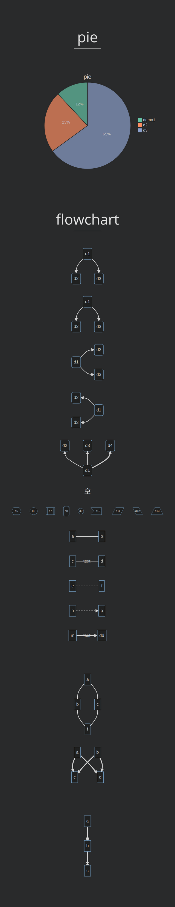